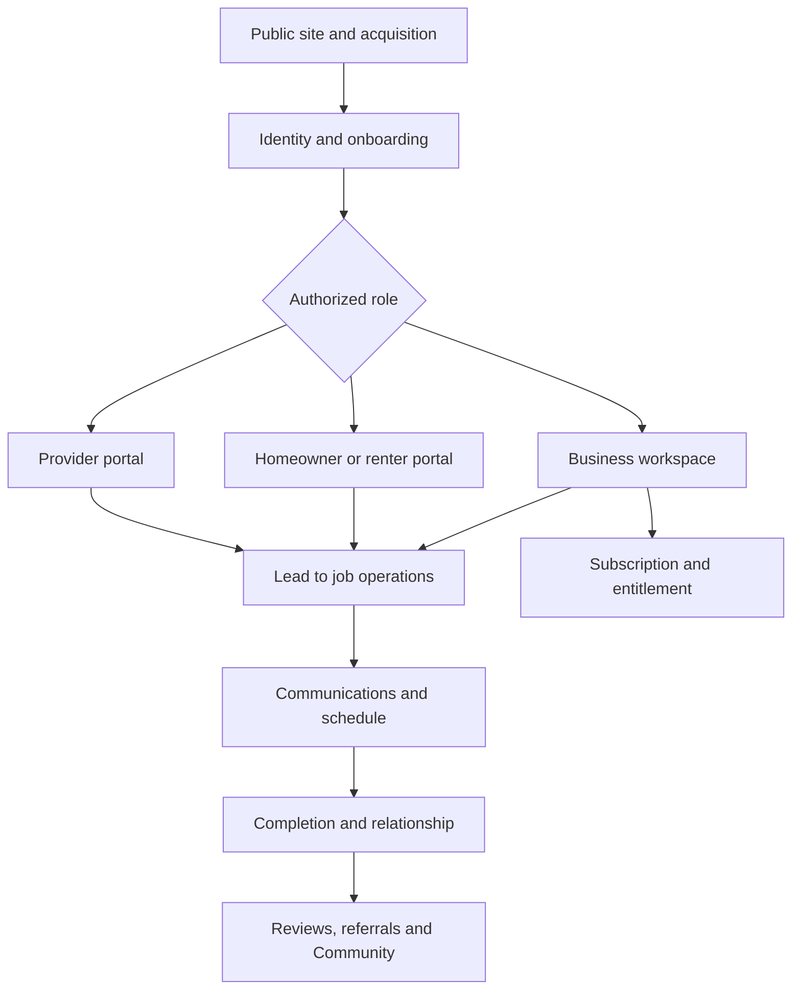
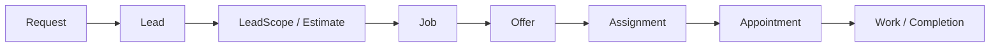
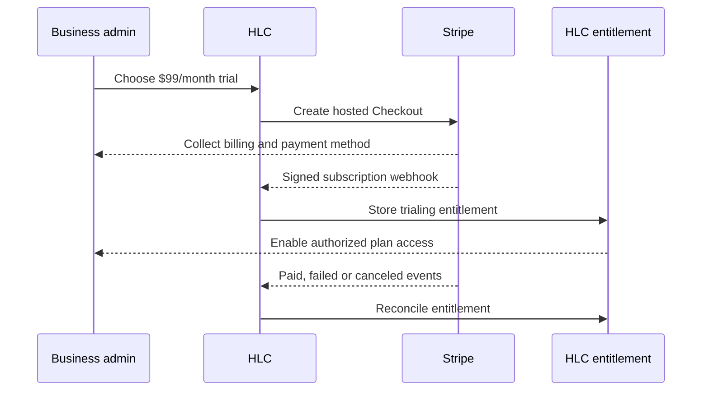
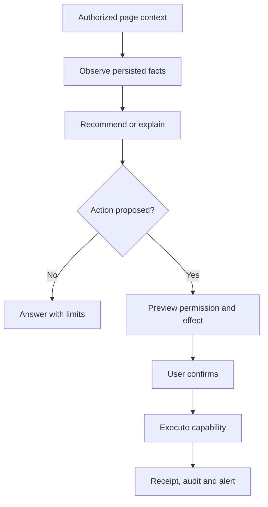

# HomeLead Connect — End-to-End Integrated Operating Blueprint

**Version:** 1.0  
**Date:** 2026-08-11  
**Owner:** Antoine Washington / HomeLead Connect LLC  
**Status:** CANONICAL INTEGRATION CONTRACT — implementation requires reconciliation and verification

## 1. Purpose

This document ties the entire HomeLead Connect ecosystem into one operating system. It defines how every major page, participant, workflow, record, agent, message, alert, tutorial, protection and subscription connects from first visit through ongoing use.

The supporting documents remain authoritative for details. This blueprint is the connective tissue and implementation order.

## 2. One ecosystem

Cross-cutting every stage: tenant/role authorization, privacy/security, rules/compliance, audit, tutorials/help, alerts and agent assistance.

## 3. Canonical record spine

Communications, activities, files, alerts, agent threads and audit events attach to canonical records; they do not create competing copies.

## 4. Identity, tenancy and authorization spine

`Account → Person profile → Role/relationship → Workspace/household/business relationship → Record permission → Capability permission`

Rules:

1. Login proves authenticator control, not business/record authorization.
2. `workspace_id` is the private business tenant boundary.
3. Homeowner/renter/provider access uses explicit user-ID-anchored relationships.
4. Email or phone similarity never authorizes records.
5. Public Directory/Community visibility is field-level opt-in.
6. Agents inherit the user’s authorized context and have narrower capability limits.

## 5. Main experience map

| Main area | Primary participants | Core destinations | Agent |
| --- | --- | --- | --- |
| Public | Visitors, prospects | Home, Platform, Professionals, Community preview, Request, Pricing, Contact, legal pages | Diamond on approved public-help surfaces |
| Dashboard | Authorized business users | KPIs, queues, alerts, upcoming work, agent summaries, quick actions | Dion; Kendrell for owner layer |
| CRM / Leads | Business teams | Leads, LeadScope, contacts, activity, follow-ups | Dion |
| Operations | Operations users | Jobs, providers, matching, offers, assignments, schedules, Call Center, analytics | Dion |
| Network / Map | Consumers/providers/businesses by permission | Directory, provider profiles, list/map, service areas, canonical record links | Diamond for discovery; Dion for operational context |
| Community | Participants/moderators | Home, discussions, updates, reviews, referrals, events, moderation | Diamond |
| Customer Experience | CX/brand users | Onboarding, cases, feedback, Community, content, brand/growth | Diamond |
| HQ | Owner/admin only | Executive overview, approvals, risks, launch, audit, agent coordination | Kendrell |
| Account | All authenticated roles | Profile, security, sessions, preferences, alerts, tutorials, connected services | Role/context agent |
| Billing | Workspace billing admins | Plan, trial, entitlement, Checkout, portal, invoices, cancellation | Kendrell/owner risk; Diamond explains |

## 6. End-to-end public-to-customer flow

### 6.1 Discovery

Visitor enters the public site, learns HLC’s real role, reviews relevant service/provider information and chooses **Request help**, **Explore providers**, **Join Community**, **Business signup** or **Sign in**.

Required integration:

- Navigation uses canonical routes.
- Diamond offers public guidance without exposing internal/private context.
- Analytics records consent-approved events only.
- Claims reflect actual feature/provider readiness.

### 6.2 Request

Public request captures service, property/location, authority, timing, contact preference, description/media consent and category fields. Server derives the target workspace/routing context, enforces idempotency and creates exactly one canonical request/lead.

System then:

- Shows honest confirmation and status path.
- Sends an approved receipt if consent/channel allows.
- Creates operational alert for the authorized queue.
- Offers account/magic-link continuation without using email match as authorization.
- Launches the correct homeowner/renter tutorial.

### 6.3 Qualification and LeadScope

Dion shows intake/evidence state, missing facts and next follow-up. Unknown remains unknown. Deterministic estimate/LeadScope output is informational and subordinate to the lead/job workflow.

If the requester is a renter, property-work authorization becomes a visible gate; Diamond explains it and Dion enforces operational state.

### 6.4 Job and provider eligibility

Approved conversion creates/links the canonical job. The matching system builds an eligible provider pool using service/task, geography, evidence/credential, insurance/compliance, capacity/time and relationship rules.

Results include reason codes. No opaque AI score, protected trait, fabricated proximity, rating or availability.

### 6.5 Offer, acceptance and assignment

Authorized operations sends an offer through an approved channel. Provider receives secure deep link, reviews minimum necessary scope/location and accepts or rejects. Acceptance creates the single active assignment. Rejection/reassignment preserves history.

Alerts:

- Provider: new offer/deadline.
- Operations: accept/reject/no response.
- Consumer: only truthful status, not a match before acceptance.

### 6.6 Scheduling

Scheduling unlocks after accepted assignment. Authorized parties propose and confirm a time. Calendar/job/appointment records remain synchronized through canonical IDs/events.

Dion explains conflicts/blockers. Diamond drafts clear confirmation/reminder language. Notifications honor timezone, consent, privacy and channel preference.

### 6.7 Work and communication

Provider receives only authorized job/location/access details at the correct stage. Participants communicate through:

- Device phone/SMS/email handoff; or
- Connected provider connector; or
- In-app messaging when implemented.

Device handoff records **opened/prepared**, provider connector records verified events, and manual outcomes are labeled user-reported.

Calls, messages, files and notes attach to the job/appointment/contact. AI summaries remain drafts until reviewed.

### 6.8 Completion, CX and relationship

Authorized completion event triggers confirmation/follow-up. A review becomes eligible only from the verified HLC relationship/event. Diamond guides feedback, recovery, Community and referral. Referral reward remains absent until economics/rules are approved.

Verified history may later contribute to reputation only under an approved transparent methodology.

## 7. End-to-end business subscription flow

The 14-day trial, monthly price and payment method at signup are disclosed before confirmation. HLC never grants access from the return URL alone. Stripe webhook/database state controls entitlement. Billing alerts reach authorized billing contacts. Customer Portal handles approved self-service changes.

Project-service money remains outside this flow.

## 8. End-to-end provider flow

`Signup/invitation → account verification → business/team relationship → service profile → service area → evidence/credentials → visibility opt-in → eligibility → offer → acceptance → schedule → work → verified outcome → review/reputation`

Provider activation has separate gates:

- Account active
- Workspace relationship active
- Operational eligibility active
- Credential/evidence state current
- Directory publication opted in
- Category/task eligibility

One gate does not imply the others.

Subcontractors receive only delegated job/task access; prime/provider hierarchy, payment and completion authority are explicit.

## 9. End-to-end renter flow

`Renter account → rental/property relationship → issue/request → category/safety screen → owner/manager authorization when required → lead/job flow → communications/schedule → completion/feedback`

Emergency/safety messaging clearly states HLC is not emergency response. Renter data is not exposed to public profiles or unrelated providers.

## 10. Map, Network and Community integration

### Map/Network

Map pins and directory cards link to canonical providers/leads/jobs/appointments according to role. Public precision is generalized; exact residences require authorized operational stage. List view is always available.

### Community

Community profiles remain separate from CRM authorization. Posts, comments, reviews, referrals and events use their own visibility/moderation states. A user may link a verified service event to an eligible review without exposing the private job.

Diamond assists Community; Dion enters only through a real operational handoff; Kendrell handles policy/risk escalation.

## 11. Agent operating loop

- Kendrell: HQ, approvals, launch, risks, policy and owner coordination.
- Dion: leads, LeadScope, matching, providers, assignments, schedule, jobs, communications operations and BI.
- Diamond: onboarding, CX, Community, reviews/referrals, communication drafts, brand/content/growth.

No agent bypasses authorization, lifecycle or provider truth.

## 12. Tutorials and help integration

Each role receives a first-run checklist connected to real completion conditions. Every major route provides page help and relevant task tutorial. Empty/error states link to the correct guide. Tutorial versions track route/component changes.

Diamond owns clarity, Dion validates operational steps and Kendrell/owner validates policy/HQ guidance. Tutorials do not advertise missing features as working.

## 13. Alerts integration

Every domain action publishes a normalized internal event. The notification policy resolves recipients, severity, preference, consent, quiet hours, privacy and channel. It creates in-app notification and optional email/SMS/push/provider delivery.

Examples:

- `lead.created` → operations queue + Dion summary.
- `offer.created` → provider action alert.
- `assignment.accepted` → operations/consumer next-step alert.
- `appointment.confirmed` → authorized participants and reminders.
- `communication.failed` → operations exception.
- `credential.expiring` → provider/admin warning.
- `review.eligible` → participant/Community prompt.
- `invoice.payment_failed` → billing-admin action alert.
- `security.new_session` → account security alert.
- `agent.action_failed` → actor plus escalation where required.

Alert deep links always re-check authentication and authorization.

## 14. Communications integration

All channels use one communication intent containing purpose, sender, recipient, canonical record, approved template/draft, consent/suppression decision and chosen route.

Routes:

- Device handoff
- Connected provider
- In-app channel

Status vocabulary distinguishes prepared/opened, provider queued, delivered where verified, failed, suppressed, expired, unknown and user-reported outcome.

## 15. Rules, protection and audit integration

Before every consequential action:

1. Authenticate user/session.
2. Authorize workspace/record/capability.
3. Evaluate policy/consent/suppression.
4. Validate current lifecycle and concurrency.
5. Preview effect where required.
6. Execute idempotently.
7. Persist event/receipt.
8. Notify authorized participants.
9. Expose correction/appeal/recovery where applicable.

Rules, terms, privacy, communications, Community, AI, provider and billing policy versions attach to relevant consent/decision records.

## 16. Shared technical services

| Service | Consumers |
| --- | --- |
| Authentication/session | Every private route and deep link |
| Authorization/RLS | CRM, portals, agents, files, Community relationships, billing |
| Canonical event/activity log | Workflows, alerts, analytics, audit |
| File/media service | Requests, profiles, jobs, Community, audio |
| Communications capability registry | CRM, Call Center, portals, alerts, agents |
| Notification service | Every domain event |
| Tutorial/help registry | Navigation, empty/error states, agents |
| Agent context/capability service | HQ, Operations, CX and contextual pages |
| Billing entitlement | Workspace plan/features |
| Policy/consent service | Communications, privacy, Community, AI, billing |
| Observability/audit | Production, providers, security and agents |

## 17. Canonical event families

- Identity/security: account, invitation, membership, session, authenticator, recovery.
- Acquisition/CRM: request, lead, LeadScope, estimate, follow-up.
- Provider: profile, relationship, evidence, eligibility, offer, assignment.
- Work: appointment, job, status, completion.
- Communication: intent, call, message, email, voicemail, transcript, delivery.
- Relationship: review, referral, CX case, Community content/moderation/event.
- Commercial: Checkout, subscription, invoice, payment, entitlement, cancellation.
- Intelligence: agent thread, context snapshot, proposal, confirmation, receipt.
- Governance: policy, consent, audit, incident, decision, alert, tutorial completion.

Every event has ID/type/version, actor, timestamp, workspace/visibility, canonical target, source, correlation/idempotency key and payload appropriate to its classification.

## 18. Data and UI truth rules

- Dashboard metrics derive from defined queries/events and include freshness/drill-through.
- Buttons map to a canonical route, capability or honestly disabled state.
- Loading, empty, partial, stale, unauthorized, setup-required and failure states exist.
- A toast cannot substitute for persistence/provider receipt.
- Map, AI, billing and communications never infer unavailable provider truth.
- Public content never exposes internal architecture, credentials or private operational data.

## 19. Mobile and desktop continuity

Every flow must support direct links, refresh/back, phone keyboard, safe-area, bottom sheets, large touch targets and return from external dialer/email/Checkout. Desktop adds persistent panels/drawers where useful. The canonical record and event history remain the same across form factors.

## 20. Implementation sequence

### Phase 0 — reconciliation

Compare documentation to release branch, historical canonical tree and live Supabase/Netlify/provider configuration. Produce route/component/schema/capability status matrix.

### Phase 1 — shared foundation

Identity/authorization, application shell/navigation, canonical activity/events, files, status/error components, audit, alerts foundation and tutorial registry.

### Phase 2 — workflow spine

Request → lead → LeadScope/estimate → job → eligibility → offer → assignment → schedule → communications → completion.

### Phase 3 — role experiences

Business dashboard/operations, homeowner/renter portal, provider/subcontractor portal, account/security and billing.

### Phase 4 — contextual agents

Thread/history/context, role ownership, proposal/confirmation/receipt, audit, Kendrell/Dion/Diamond placement and mobile UI.

### Phase 5 — Network/Map/Community/CX

Directory profiles, visibility, list/map, Community, reviews/referrals, moderation, events and Diamond CX/brand systems.

### Phase 6 — providers and automation

Communications connectors, Stripe live integration, email/SMS/calling, transcription/voice, push and approved automation.

### Phase 7 — launch hardening

Security/privacy/compliance, accessibility, monitoring, backup/restore, incident/rollback, performance and complete preview verification.

## 21. End-to-end acceptance journeys

The release cannot be called complete until these pass:

1. New homeowner request through accepted provider, schedule, communication, completion and review eligibility.
2. Renter request with authority gate and honest blocked/approved paths.
3. Provider signup through evidence, offer, acceptance, schedule and job access.
4. Subcontractor delegated access with denial of unauthorized customer/payment fields.
5. Business signup through Stripe trial, webhook entitlement, onboarding and first lead.
6. Failed subscription payment through alert, portal action and entitlement reconciliation.
7. Device phone/SMS/email handoff and connected-provider success/failure paths.
8. Kendrell/Dion/Diamond context, handoff, confirmation, execution receipt and cross-workspace denial.
9. Community discussion/report/moderation/appeal and verified-event review.
10. Map/list discovery with correct precision and canonical record link.
11. Security event/new session through alert, session revoke and recovery.
12. Mobile onboarding/tutorial/deep-link/notification flow.

## 22. Definition of done

A feature is done only when route/UI, domain contract, data/persistence, tenant/role authorization, external provider path, audit/events, alerts, tutorial/help, empty/error/loading/mobile/accessibility states, tests, build, preview deployment and evidence all pass.

## 23. Governing documents

This integration blueprint connects:

- Canonical Ecosystem Page Blueprint
- Kendrell, Dion and Diamond Operating Models
- Participant/Profile/Matching Model
- Map/Network/Community Model
- Business/Product/Operations Manual
- Communications and Agent Script Libraries
- Audio/Voice/Calling System
- Provider-Agnostic Communications Architecture
- Rules/Laws/Protection Framework
- Login/Identity/Access Model
- Tutorials/Help/Onboarding System
- Alerts/Notification System
- Subscription/Billing/Stripe System
- Technical/Security/Deployment Runbook
- Launch/Compliance/Verification Manual
- Documentation/Decision Register

If a supporting document conflicts with this integration contract, record the contradiction in the Decision Register and obtain owner approval; do not silently choose.

## 24. Current status

